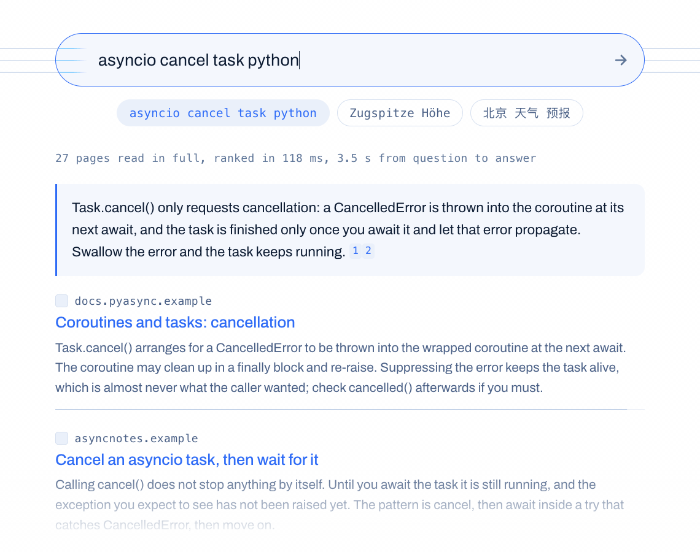
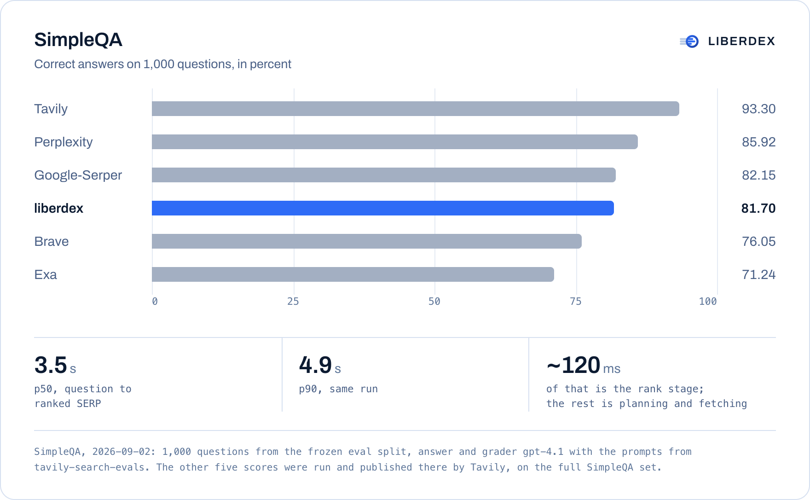

# liberdex

[](https://github.com/beneglo/liberdex/actions/workflows/ci.yml)
[](https://github.com/beneglo/liberdex/releases)
[](LICENSE)
[](pyproject.toml)

An index-free web search engine. [liberdex.net](https://liberdex.net)

There is no crawler and no inverted index. When a query arrives, an LLM is asked
where the answer lives on the web, from parametric memory alone with no search
tool of its own, and liberdex fetches those pages in parallel, extracts the main
content, and reranks it into a Google-style SERP.

<p align="center">
  <picture>
    <source media="(prefers-color-scheme: dark)" srcset=".github/assets/search-dark.gif">
    
  </picture>
  <br>
</p>

```
query ──► planner LLM ──► candidate URLs, hub pages, per-site search queries,
      │                   keyword expansions, answer language
      └─► heuristic intent + language guess ──► site-native search  (fires at t=0)
                                          │
                                          ▼
                          parallel fetch (curl_cffi, Chrome TLS)
                                          │
                                          ▼
                      extract (selectolax density + trafilatura)
                                          │
                     ┌────────────────────┤
                     ▼                    │
       every page is also a directory:    │  a link whose anchor fits the query
       follow the links that fit the    ──┤  better than the page it sits on is
       query better than the page does    │  fetched
                     │                    │
                     ▼                    │
       the guess 404'd, or served a       │  the host publishes the list of its
       script loader, or was a homepage:  │  own pages. read it and pick again:
       read the host's own sitemap and  ──┤  no crawl, no index
       pick the slug that fits            │
                                          ▼
              rank: bm25s ─┬─ potion-retrieval-32M ─┬─ MiniLM cross-encoder, scored as pages land
                           ├─ aspect coverage: how many of the query's distinct
                           │  constraints the page announces itself to meet
                           └─ priors: authority, host-name match, consensus,
                              freshness, URL match, all gated on relevance
                                          │
                                          ▼
                                        SERP
```

## Three ways to use it

### In your agent CLI

Claude Code, Codex, OpenCode, Cursor, Gemini CLI, hermes-agent, OpenClaw, T3
Code. The host model writes the plan itself, since it already has the web in
its memory and you already pay for it, and liberdex fetches, reads and ranks.
No API key, no second model, first fetch at t=0. Where the host has no web
search of its own (OpenCode on your own keys, T3 Code), this is the search; in
hermes it becomes the `web_search` the agent already has.

```bash
uvx --from git+https://github.com/beneglo/liberdex liberdex install claude-code
# or codex | opencode | cursor | gemini | hermes | openclaw | t3code
```

### As your search engine

A page, ten links, an answer, full-page passages underneath. Bring a key for
OpenRouter or any OpenAI-compatible endpoint, a local runtime, or the `claude` /
`codex` / `gemini` / `opencode` subscription already on your machine. Pick it in
the settings drawer. Chrome and Firefox will take it as the default engine.

```bash
uvx --from git+https://github.com/beneglo/liberdex liberdex serve --open
```

### As an endpoint

The same server, for your programs and other people's: JSON, streaming,
`/extract`, `/plan`, and MCP at `/mcp` so claude.ai, Claude Desktop and ChatGPT
can connect to your own instance. Keys, CORS and an in-flight cap for the day
you open the port.

```bash
docker run -p 8080:8080 -e OPENROUTER_API_KEY=… ghcr.io/beneglo/liberdex
```

Not on PyPI yet, so `uvx` and `pip` take the repository. As a library:
`pip install git+https://github.com/beneglo/liberdex` or
`uv add git+https://github.com/beneglo/liberdex`, then
`from liberdex import Liberdex`. Python 3.12+.

The first run downloads two small ranking models (~130 MB). `liberdex warmup`
does it ahead of time, and the container ships with them.

| | |
| --- | --- |
| [docs/agents.md](docs/agents.md) | inside Claude Code, Codex, OpenCode, Cursor, Gemini CLI, hermes-agent, OpenClaw, T3 Code; the skill; the two tools |
| [docs/search-engine.md](docs/search-engine.md) | the page, settings, subscriptions, deep, page turns |
| [docs/deploy.md](docs/deploy.md) | keys, CORS, in-flight cap, Docker, the Python client, the MCP connector |
| [docs/http.md](docs/http.md) | `/search`, streaming, typed answers, reweighting, `/extract`, `/plan` |
| [docs/models.md](docs/models.md) | planner and answer roles, eighteen built-in profiles, `models.toml`, thinking budgets |
| [docs/library.md](docs/library.md) | the command line and the Python API |
| [skills/liberdex/references/plan-protocol.md](skills/liberdex/references/plan-protocol.md) | the plan a caller sends as JSON: fields, intents, routes, examples |

## Results

<picture>
  <source media="(prefers-color-scheme: dark)" srcset=".github/assets/results-dark.png">
  
</picture>

SimpleQA, 2026-09-02: 1,000 questions from the frozen eval split, answer and
grader gpt-4.1 with the prompts from
[tavily-search-evals](https://github.com/tavily-ai/tavily-search-evals).
liberdex answers **81.70** percent correctly. The other five scores were run and
published there by Tavily, on the full SimpleQA set.

The harness talks to the live web and to a paid grader, so it ships with
neither the package nor CI.

## Privacy

Nothing on the page reaches a third party: the font is self-hosted, result
favicons are fetched by liberdex and served from `/icon`, links carry
`rel="noreferrer"`, and a `default-src 'self'` Content-Security-Policy makes the
browser enforce it. Keys you type into the page go to `~/.config/liberdex/env`
on the machine running liberdex and nowhere else; `models.toml`, which can be
checked in, only ever holds the name of the variable a key lives in. There is no
telemetry.

Plans are cached locally in `~/.cache/liberdex`.

## Responsible use

liberdex is a research tool. Running it makes you the operator of every request
it sends, and the responsibility for those requests is yours.

The fetcher impersonates a Chrome TLS fingerprint and sends a Chrome
`User-Agent`, which is what gets it past the bot walls that reject plain HTTP
clients, and many sites' terms of service prohibit exactly that. Nothing here
reads `robots.txt`, because liberdex fetches a handful of pages the planner
named rather than sweeping a domain. Neither is a licence to ignore a site's
stated rules: check the terms of anything you fetch at volume, respect rate
limits and `Retry-After`, and throttle yourself where a site asks you to.

Fetched page content belongs to whoever published it. liberdex holds it only for
the life of a query and writes caches wherever you point them; it does not
bundle, republish or redistribute anyone's pages, and neither should you without
checking that you may.

The software and the shared plan cache are free of charge and provided as is,
without warranty of any kind. The shared plan cache is not part of this package
and may change or stop at any time. What liberdex fetches, ranks and answers on the strength of it is at
your own risk, and we accept no liability for it. See the licence.

## Licence

Copyright (C) 2026 Gloria Capital GmbH.

liberdex is free software under the [GNU Affero General Public License
v3.0 or later](LICENSE). You may run it, study it, change it, and redistribute
it; if you modify it and let others use it over a network, you must offer them
the modified source under the same terms.

Contributions require signing the [Contributor License Agreement](CLA.md); see
[CONTRIBUTING.md](CONTRIBUTING.md).
